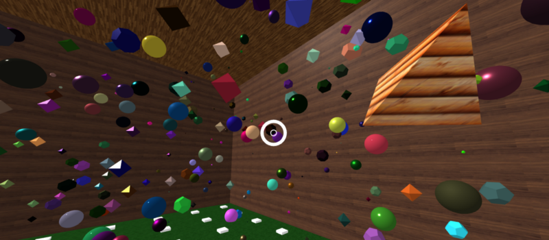

# VR Scavenger Hunt: Designing Another World

---

In this simple game optimized for mobile phones using Google Cardboard, players search for three wooden objects in a VR room filled with randomly generated shapes.  Can you find them??

_Contributors: Keller Chambers, Uttam Kumaran, Lucas Nicolois, Nick Simons_
_-For Human-Computer Interaction with Professor Evan Peck, Bucknell University Department of Computer Science_

---

### Motivation

In recent years, Escape Rooms have become an increasingly popular activity for friends to challenge themselves and have fun.  Our team was inspired to create something like an Escape Room in Virtual Reality.  After much discussion, prototyping, and user testing, we ended up with something a VR amalgamation of an Escape Room and a scavenger hunt.  

---

### Tech

Built with:
[A-Frame](https://aframe.io), a web framework for building virtual reality experiences. Make WebVR with HTML and Entity-Component. Works on Vive, Rift, desktop, mobile platforms.

---

### Usage

Try out the game by following [this link!](https://amber-condor.glitch.me/)
Check out our [quick demo video](https://www.youtube.com/watch?v=Z5Izr_7c_iA) or just read the instructions below

* The goal is to locate the three wooden shapes hidden throughout the room
* Look around by moving the camera.
    * On Desktop: Click and drag
    * On a smartphone: Use the device motion sensors
    * Or try [plugging in a VR headset](https://webvr.rocks)!
* Focus the bullseye on an object for a moment to select it.  When you successfully select a wooden object, it will begin to spin.
* Move about the room by focusing on the white, rectangular targets on the floor.

---

## Have fun!
